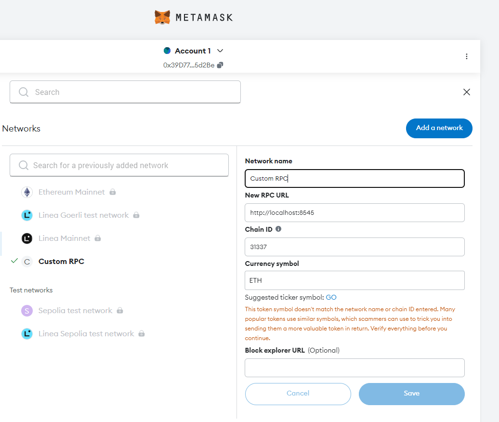
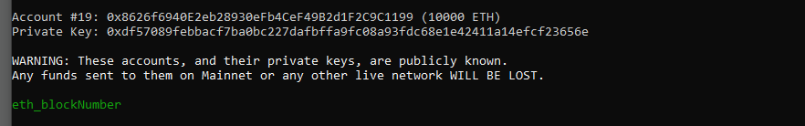
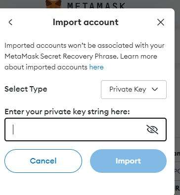
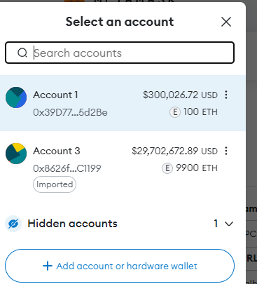
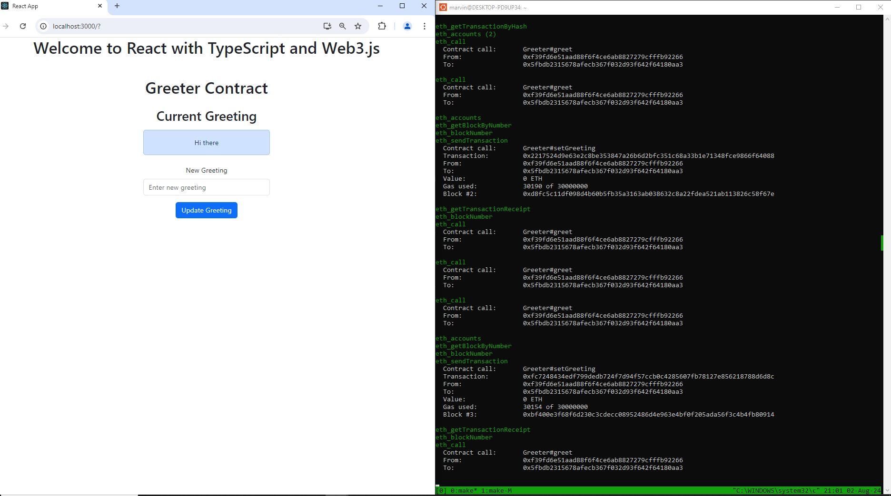

# web3-poc

## Table of Content

- [Summary](#summary)
- [References](#references)
- [Preconditions](#preconditions)
- [Getting Started](#getting-started)

## Summary

Proof of Concept (PoC) demonstrating the integration of Web3 technologies into a decentralized application (dApp)

**NOTE** In this proof of concept (PoC) we are only working with a local Hardhat node and not interacting with test or production networks.

## References

- [Hardhat Ethereum development environment](https://github.com/NomicFoundation/hardhat)
- [Deploying your contracts](https://hardhat.org/hardhat-runner/docs/guides/deploying)
- [OpenZeppelin](https://wizard.openzeppelin.com/#erc20)

## Preconditions

- Unix-like terminal (Ubuntu WSL on Windows OS)
- Ensure you have Node.js and npm installed
- Install npm dependencies by running:

```sh
cd hardhat
npm install
cd -
cd web3-sample-dapp
npm install
cd -
```

- Add [MetaMask extension](https://chromewebstore.google.com/detail/metamask/nkbihfbeogaeaoehlefnkodbefgpgknn) for signed transactions. Therefore
    1. Setup custom RPC network similar to: 

    

    2. Import private keys similar to:
    <table>
    <tr>
        <td></td>
        <td></td>
    </tr>
    </table>

    3. Transfer ETH to Account 1 similar to:

    

## Getting Started

Open one terminal and start the local Ethereum node by executing:

```sh
make launch-local-eth-node
```

In a second terminal compile and deploy the Greeter smart contract [Greeter smart contract](./hardhat/contracts/Greeter.sol) with:

```sh
make compile-and-deploy-greeter-smart-contract
```

Finally in the second terminal start the React dapp by running:: 

```sh
make start-react-app
```

Results should resemble the following:


